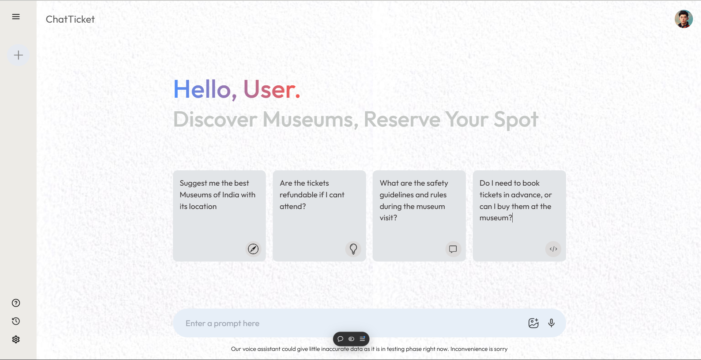
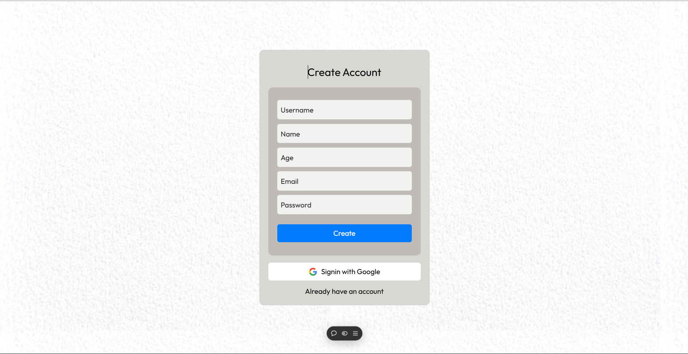

# Chatbot Ticketing System

A deep learning-based chatbot system developed as a Smart India Hackathon (SIH) and Minor Project. This application facilitates museum ticket booking by providing users with information about museum availability, scheduling, and more. The chatbot includes secure authentication using Firebase OAuth and advanced NLP features like intent classification and error correction.

[Live Demo](https://chat-ticket.vercel.app/)

---

## Overview
This project is a collaborative effort among three team members:
- **Frontend Development:** Handled by [Your Name]. Built with **Next.js** and **TypeScript**, integrated Firebase for OAuth authentication.
- **Backend Development:** Managed by Jeevesh, including chatbot logic and intent classification.
- **Database Management:** Managed by Alok, ensuring secure and efficient data storage.

The chatbot is trained on a custom model and provides:
- Real-time responses to user queries.
- Intent classification for understanding user inputs.
- Error correction for better input handling.

---

## Features
- **Chatbot Functionality:** Answers questions about museums and assists in ticket booking.
- **Firebase OAuth:** Secure user authentication.
- **Custom Deep Learning Model:** For accurate intent classification and error correction.
- **Responsive Design:** User-friendly interface optimized for all devices.
- **Error Handling:** Corrects input mistakes for seamless user interaction.

---

## Screenshots
### Chatbot Interface:


### Ticket Booking Interface:


---

## Technologies Used

### Frontend
- **Next.js:** Framework for server-rendered React applications.
- **TypeScript:** Enhances development with static typing.
- **Tailwind CSS:** For styling and responsive design.

### Backend
- **Firebase Authentication:** For secure user login and OAuth integration.
- **Custom Deep Learning Model:** For chatbot responses and error correction.

### Hosting
- Hosted on Vercel: [Live Demo](https://chat-ticket.vercel.app/)

---

## Dependencies
```json
{
  "dependencies": {
    "@google/generative-ai": "^0.17.1",
    "@types/firebase": "^3.2.1",
    "dotenv": "^16.4.5",
    "firebase": "^10.13.1",
    "next": "14.2.6",
    "react": "^18",
    "react-dom": "^18",
    "react-router-dom": "^6.26.1"
  },
  "devDependencies": {
    "@types/node": "^20",
    "@types/react": "^18",
    "@types/react-dom": "^18",
    "eslint": "^8",
    "eslint-config-next": "14.2.6",
    "postcss": "^8",
    "tailwindcss": "^3.4.1",
    "typescript": "^5"
  }
}
```

---

## Installation

### Prerequisites
- Node.js and npm installed.
- Firebase project set up.

### Steps
1. Clone the repository:
   ```bash
   git clone https://github.com/your-username/sih-chatbot-ticketing.git
   ```

2. Navigate to the project directory:
   ```bash
   cd sih-chatbot-ticketing
   ```

3. Install dependencies:
   ```bash
   npm install
   ```

4. Configure environment variables:
   Create a `.env` file and add:
   ```env
   NEXT_PUBLIC_FIREBASE_API_KEY=your_api_key
   NEXT_PUBLIC_FIREBASE_AUTH_DOMAIN=your_auth_domain
   NEXT_PUBLIC_FIREBASE_PROJECT_ID=your_project_id
   NEXT_PUBLIC_FIREBASE_STORAGE_BUCKET=your_storage_bucket
   NEXT_PUBLIC_FIREBASE_MESSAGING_SENDER_ID=your_messaging_sender_id
   NEXT_PUBLIC_FIREBASE_APP_ID=your_app_id
   NEXT_PUBLIC_FIREBASE_MEASUREMENT_ID=your_measurement_id
   ```

5. Start the development server:
   ```bash
   npm run dev
   ```

6. Open your browser and navigate to:
   ```
   http://localhost:3000
   ```

---

## How It Works
1. **User Authentication:** Secure login via Firebase OAuth.
2. **Chatbot:** Users can ask questions related to museum ticket booking.
3. **Intent Classification:** Understands the user’s query using NLP techniques.
4. **Error Correction:** Adjusts misspelled or incorrect inputs for better interaction.

---

## Future Improvements
- Integrate payment gateway for direct ticket booking.
- Expand chatbot capabilities to include multiple languages.
- Add admin panel for museum management.

---

## License
This project is licensed under the MIT License. See the LICENSE file for details.

---

## Contribution
Contributions are welcome! Feel free to fork the repository and submit a pull request.

---

## Contact
For queries or feedback, please contact:
- [Shubham](mailto:shubhamjaishu@gmail.com)
- [Jeevesh](mailto:jeevesh2002@gmail.com)
- [Alok](mailto:anandkumar19d@gmail.com)
